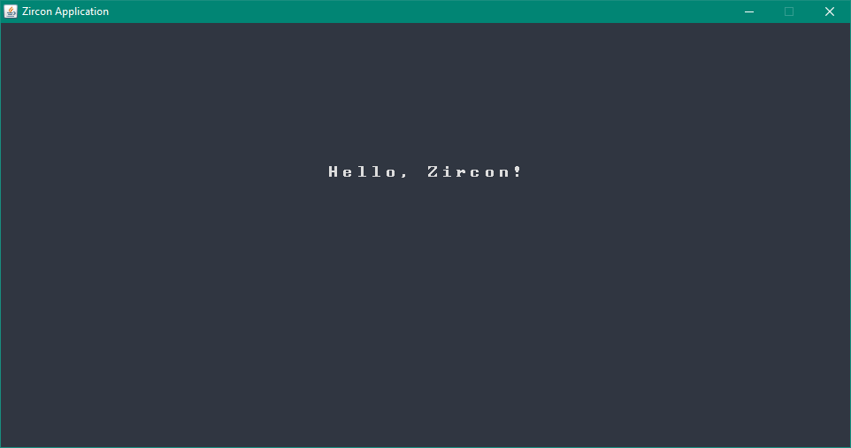
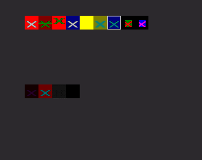
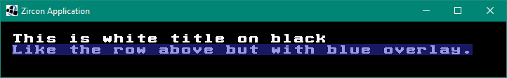
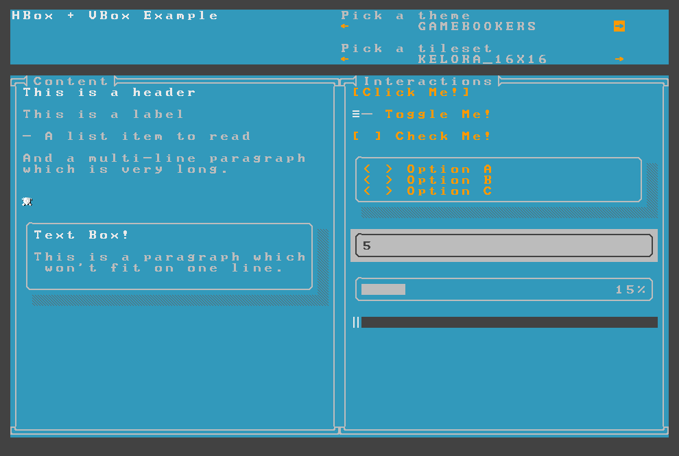

# Zircon - A user-friendly Tile Engine & Text GUI [](https://twitter.com/intent/tweet?text=Do%20you%20plan%20to%20make%20a%20roguelike%3F%20Look%20no%20further.%20Zircon%20is%20the%20right%20tool%20for%20the%20job.&url=https://github.com/Hexworks/zircon&hashtags=games,roguelikes)


Need info? Check the [Docs][zircon-docs]
| or [Create an issue](https://github.com/Hexworks/zircon/issues/new)
| Check [our project Board](https://github.com/Hexworks/zircon/projects/2)
| [Ask us on Discord][discord]
| Support us on [Patreon](https://www.patreon.com/hexworks)
| [Javadoc / Kdoc](https://hexworks.github.io/zircon/)

[](https://circleci.com/gh/Hexworks/zircon/)
[](https://maven-badges.herokuapp.com/maven-central/org.hexworks.zircon/zircon.core)
[](https://opensource.org/licenses/Apache-2.0)
[](https://github.com/sindresorhus/awesome)

---

## Table of Contents

- [Getting Started](#getting-started)
    - [Adding Zircon as a Maven Dependency](#adding-zircon-as-a-maven-dependency)
    - [Basic Usage](#basic-usage)
- [Best Practices](#best-practices)
- [Features at a Glance](#features-at-a-glance)
    - [Drawing](#drawing)
    - [Input Handling](#input-handling)
    - [Layering](#layering)
    - [Text GUI Components](#text-gui-components)
    - [Animations](#animations)
    - [Shape and Box Drawing](#shape-and-box-drawing)
    - [Fonts and Tilesets](#fonts-and-tilesets)
    - [Road Map](#road-map)
    - [License](#license)
    - [Credits](#credits)
    - [Thanks](#thanks)

## Getting Started

If you want to start working with Zircon you can either add it to your project as a Maven dependency or you can try out
the skeleton projects
([Java](https://github.com/Hexworks/zircon.skeleton.java), [Kotlin](https://github.com/Hexworks/zircon.skeleton.kotlin))
which come with batteries included.

The official [documentation site][zircon-docs] contains a lot of information. The examples are also documented on the
[Zircon Examples](https://hexworks.org/zircon/examples/) page *(under construction)*, and the best place to start is the
[Zircon Crash Course](https://hexworks.org/zircon/docs/2018-07-18-a-zircon-crash-course).

If you like learning by doing check out the source of *Zircon* from [here](https://github.com/Hexworks/zircon) and you
can run the examples for yourself. If you are using *Java*
start [here](https://github.com/Hexworks/zircon/tree/master/zircon.jvm.examples/src/main/java/org/hexworks/zircon/examples)
. Alternatively if you use *Kotlin* the code can be
found [here](https://github.com/Hexworks/zircon/tree/master/zircon.jvm.examples/src/main/kotlin/org/hexworks/zircon).

If you just want to peruse the *Zircon* API navigate [here][api]. Everything which is intended to be part of the public
API is there.

You can find the *Javadoc* / *Kdoc* [here](https://hexworks.github.io/zircon/)

If you'd like to talk to us, join us on our [Discord Server][discord].

### Adding Zircon as a Maven Dependency

Maven:

```xml

<dependencies>
    <dependency>
        <groupId>org.hexworks.zircon</groupId>
        <artifactId>zircon.core-jvm</artifactId>
        <version>2021.1.0-RELEASE</version>
    </dependency>
    <!-- use zircon.jvm.libgdx if you want to use LibGDX instead of Swing -->
    <dependency>
        <groupId>org.hexworks.zircon</groupId>
        <artifactId>zircon.jvm.swing</artifactId>
        <version>2021.1.0-RELEASE</version>
    </dependency>
</dependencies>
```

Gradle:

```groovy
dependencies {
    implementation "org.hexworks.zircon:zircon.core-jvm:2021.1.0-RELEASE"
    implementation "org.hexworks.zircon:zircon.jvm.swing:2021.1.0-RELEASE"
}
```

### Basic Usage

Once you have the dependencies set up you can start using *Zircon* by creating a `TileGrid`:

```java
public class Main {

    public static void main(String[] args) {

        // a TileGrid represents a 2D grid composed of Tiles
        TileGrid tileGrid = SwingApplications.startTileGrid(
                AppConfig.newBuilder()
                        // The number of tiles horizontally, and vertically
                        .withSize(60, 30)
                        // You can choose from a wide array of CP437, True Type or Graphical tilesets
                        // that are built into Zircon
                        .withDefaultTileset(CP437TilesetResources.rexPaint16x16())
                        .build());

        // A Screen is an abstraction that lets you use text GUI Components
        // You can have multiple Screens attached to the same TileGrid to be able to create multiple
        // screens for your app.
        Screen screen = Screen.create(tileGrid);

        // Creating text GUI Components is super simple
        Label label = Components.label()
                .withText("Hello, Zircon!")
                .withAlignment(ComponentAlignments.alignmentWithin(tileGrid, ComponentAlignment.CENTER))
                .build();

        // Screens can hold GUI components
        screen.addComponent(label);

        // Displaying a screen will make it visible. It will also hide a previously shown Screen.
        screen.display();

        // Zircon comes with a plethora of built-in color themes
        screen.setTheme(ColorThemes.arc());
    }
}
```

The output of this example is:



*Congratulations!* Now you are a *Zircon* user.

## Best Practices

The following are some guidelines that can help you if you get *stuck*:

If you want to build something (a `TileGraphics`, a `Component` or anything that is part of the public API) it is
almost sure that there is a `Builder` or a factory object for it. Each type that has a builder will have a
`newBuilder` function you can call to create the corresponding builder: `Tile.newBuilder()`.

If there are multiple classes of objects that can be created there might also be a utility class, 
like `Shapes` to create different `Shape` objects. Your IDE will help you with this.

These classes reside in the `org.hexworks.zircon.api` package. There are some classes that are grouped together into a
single utility class, however. With `Components` for example, you can obtain `Builder`s for all `Component`s
like `Components.panel()` or `Components.checkBox()`. Likewise, you can use `DrawSurfaces` to obtain builders
for `TileGraphics` and `TileImage`.

If you want to work with external files like tilesets or REXPaint files check the same  package
(`org.hexworks.zircon.api`), and look for classes that end with `*Resources`. There are a bunch of built-in tilesets
for example which you can choose from, but you can also load your own.

The rule of thumb is that if you need something external there is probably a `*Resources` class for it (like
the `CP437TilesetResources`).

You can use *anything* you can find in the [API][api] package, they are part of the public API, and safe to use.
The [internal][internal] package however is considered private to *Zircon* so keep in mind that they can change any
time.

Some topics are explained in depth in the [documentation][zircon-docs].

If you want to see some example code take a look at the examples project [here][examples]. Most examples have
identical *Java* and *Kotlin* variants.

If all else fails read the javadocs. API classes are well documented.

If you have any problems that are not answered here feel free to ask us at the [Hexworks Discord server][discord].

## Features at a Glance

### Drawing

> You can find detailed documentation about drawing [here][drawing-docs].

The most basic operation *Zircon* supports is `draw`ing. You can draw individual `Tile`s or `TileGraphics` objects on
your `TileGrid`. a `TileGraphics` object is composed of `Tile`s. This is a powerful tool, and you can implement more
complex features using simple `draw` operations. In fact the component system is implemented on top of drawing, layering
and input handling features.

If you use REXPaint to design your programs, the good news is that you can import your `.xp` files as well. Read more
about it [here](https://hexworks.org/zircon/docs/2018-11-22-resource-handling#rexpaint-files).

You can also use `Modifier`s in your `Tile`s such as `blink`, `verticalFlip` or `glow`. For a full list, check
[this](https://github.com/Hexworks/zircon/blob/master/zircon.core/src/commonMain/kotlin/org/hexworks/zircon/api/Modifiers.kt)
factory object.
`Modifier`s can either change the texture (like the ones above) or the `Tile` itself:



### Input handling

> Read about input handling in the docs [here][input-docs].

Both the `TileGrid` and the `Screen` interfaces implement `UIEventSource` which means that you can listen for user
inputs using them. This includes *keystrokes* and *mouse input* as well.

### Layering

> Layering is detailed [here][layer-docs]. For a primer on `Screen`s go [here][screen-docs].

Both the `TileGrid` and the `Screen` interfaces implement `Layerable` which means that you can add `Layer`s on top of
them. Every `Layerable` can have an arbitrary amount of `Layer`s. `Layer`s are like `TileGraphics` objects, and you can
also have transparency in them which can be used to create fancy effects.
`Component`s are also `Layer`s themselves. Take a look:



### Text GUI Components

> You can read more about the Component System on the [documentation page][component-docs].
> Color themes are detailed [here][color-theme-docs].

`Component`s are GUI controls which can be used for showing content to the user (`Label`s, `Paragraph`s, etc.), enabling
them to interact with your program (`Button`s, `Slider`s, etc.) or to hold other components (`Panel`s for example).

These components are rather simple, and you can expect them to work in a way you might be familiar with:

- You can click on them (press and release are different events).
- You can attach event listeners on them.
- Zircon implements focus handling, so you can navigate between the components using the `[Tab]` key
  (forwards) or the `[Shift]+[Tab]` keystroke (backwards).
- Components can be hovered, and you can also apply color themes to them.

What's more is that you can apply `ColorTheme`s to `Component`s. There are a bunch of built-in themes, and you can also
create your own.

To see a full list of available `Component`s take a look at the
[Components](https://github.com/Hexworks/zircon/blob/master/zircon.core/src/commonMain/kotlin/org/hexworks/zircon/api/Components.kt)
factory object or navigate to the [component docs page][component-docs].

This is an example of how components look in action:



### Animations:

> Read more about Animations in the [docs][animation-docs].

Animations are supported out of the box. You can either create them programmatically, or statically using *Zircon's* own
animation format: `.zap` (Zircon Animation Package). More about that [here][animation-docs]. This is how an animation
looks like:


### Shape and box drawing

> The shape documentation page can be found [here][shape-docs].

You can draw `Shape`s like rectangles and triangles by using one of the `ShapeFactory` implementations. What's supported
out of the box is
*triangle*, *rectangle* and *line*. The former two have filled versions as well. Check out the `Shapes` factory object
[here](https://github.com/Hexworks/zircon/blob/efa5b6f317eda9c22834140588dcbdd47fb4a3ab/zircon.core/src/commonMain/kotlin/org/hexworks/zircon/api/Shapes.kt)
.

### Fonts and Tilesets

> The documentation page for tilesets is [here][tileset-docs].

Zircon comes with a bunch of built-in fonts tilesets. These come in 3 flavors:

- CP437 tilesets *(More on using them 
  [here](https://hexworks.org/zircon/docs/2018-11-22-resource-handling#cp437-tilesets))*
- True Type Fonts
- and Graphical tilesets *(Usage info
  [here](https://hexworks.org/zircon/docs/2018-11-22-resource-handling#graphical-tilesets))*

Zircon also comes with its own tileset format (`ztf`: Zircon Tileset Format) which is **very easy to use**. It is
detailed [here](https://hexworks.org/zircon/docs/2018-11-22-resource-handling#the-zircon-tileset-format).

## Road Map

If you want to see a new feature feel free to [create a new Issue](https://github.com/Hexworks/zircon/issues/new) or
discuss it with us on [Discord][discord]. Here are some features which are either under way or planned:

- [x] [Scrollable Components](https://github.com/Hexworks/zircon/issues/25)
- [x] [Menus](https://github.com/Hexworks/zircon/issues/135)
- [x] [Table Component](https://github.com/Hexworks/zircon/issues/185)
- [x] [Javadoc-style Documentation](https://github.com/Hexworks/zircon/issues/146)
- [x] [Grid / Screen Filters](https://github.com/Hexworks/zircon/issues/271)
- [ ] [Floating Components](https://github.com/Hexworks/zircon/issues/23)
- [ ] [Drag'n Drop Support](https://github.com/Hexworks/zircon/issues/22)
- [ ] [Custom Layout Support](https://github.com/Hexworks/zircon/issues/28)
- [ ] [Component Themes](https://github.com/Hexworks/zircon/issues/29)
- [ ] [Custom Component Support](https://github.com/Hexworks/zircon/issues/26)
- [ ] [Tree Component](https://github.com/Hexworks/zircon/issues/184)
- [ ] [Accordion Component](https://github.com/Hexworks/zircon/issues/27)
- [ ] [Combo Box Component](https://github.com/Hexworks/zircon/issues/262)
- [ ] [IntelliJ Plugin](https://github.com/Hexworks/zircon/issues/191)
- [ ] [Console for Zircon](https://github.com/Hexworks/zircon/issues/183)

If you'd like to give any of these a shot feel free to *contribute*.

## License

Zircon is made available under the [Apache 2.0 License](https://www.apache.org/licenses/LICENSE-2.0).

## Credits

Zircon is created and maintained by Addamsson, Coldwarrl, G3ldrin, Milonoir, Seveen and many others.

*We're open to suggestions, feel free to message us on [Discord][discord] or open an issue.*
*Pull requests are also welcome!*

Zircon is powered by:

<a href="https://www.jetbrains.com/idea/">
    
</a>
<a href="https://kotlinlang.org/">
    
</a>
<a href="https://www.yourkit.com/java/profiler/">
    
</a>

## Thanks

Thanks to the folks over at [Dwarf Fortress Tileset Repository](http://dwarffortresswiki.org/Tileset_repository) for
letting us bundle their tilesets.

Thanks to *Kyzrati* who let us bundle the [REXPaint Tilesets](https://www.gridsagegames.com/rexpaint/) into Zircon!

Zircon comes bundled with the [Nethack Tileset](https://nethackwiki.com/wiki/Tileset).

Some True Type fonts are used from [Google Fonts](https://fonts.google.com/).

Thanks to *VileR* for the [Oldschool Font Pack](https://int10h.org/oldschool-pc-fonts/) which we bundled into Zircon.


[discord]:https://discord.gg/vSNgvBh
[zircon-version]:2021.1.0-RELEASE
[examples]:https://github.com/Hexworks/zircon/tree/master/zircon.jvm.examples/src/main
[api]:https://github.com/Hexworks/zircon/tree/master/zircon.core/src/commonMain/kotlin/org/hexworks/zircon/api
[internal]:https://github.com/Hexworks/zircon/tree/master/zircon.core/src/commonMain/kotlin/org/hexworks/zircon/internal
[resource]:https://github.com/Hexworks/zircon/tree/master/zircon.core/src/commonMain/kotlin/org/hexworks/zircon/api/resource
[zircon-docs]:https://hexworks.org/zircon/docs/
[animation-docs]:https://hexworks.org/zircon/docs/2019-04-26-animation-support
[color-theme-docs]:https://hexworks.org/zircon/docs/2018-11-20-working-with-color-themes
[component-docs]:https://hexworks.org/zircon/docs/2018-11-15-the-component-system
[crash-course]:https://hexworks.org/zircon/docs/2018-07-18-a-zircon-crash-course
[design-docs]:https://hexworks.org/zircon/docs/2018-11-20-the-design-philosophy-behind-zircon
[input-docs]:https://hexworks.org/zircon/docs/2018-11-21-input-handling
[layer-docs]:https://hexworks.org/zircon/docs/2018-11-21-how-layers-work
[logging-docs]:https://hexworks.org/zircon/docs/2019-03-27-logging
[release-docs]:https://hexworks.org/zircon/docs/2019-01-11-release-process-and-versioning-scheme
[screen-docs]:https://hexworks.org/zircon/docs/2018-08-18-a-primer-on-screens
[shape-docs]:https://hexworks.org/zircon/docs/2018-11-21-shapes
[drawing-docs]:https://hexworks.org/zircon/docs/2018-11-19-how-to-work-with-tile-graphics
[tileset-docs]:https://hexworks.org/zircon/docs/2018-11-22-resource-handling


